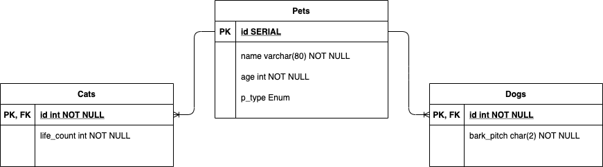
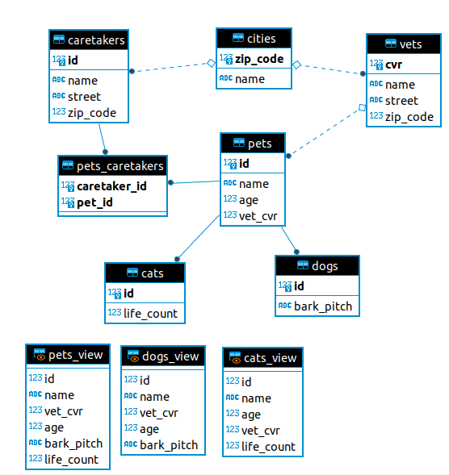

# Assignment #1 - Relational Databases
[Link to assignment](01-relational-db.pdf)  

## Design  

#### Inheritance strategies

- **Joint-table strategy**
  + Pros:
    - Developmental Dynamic
      + (If you want to add a new attribute, you just create a new coulumn in the respective table.)
    - Follows OOP paradigm
  + Cons:
    - Structure gets complicated 
    - Runtime data updates are slow
      + Especially as inheritance tree gets deeper, and e.g. updates has to go through several tables, and obviously having to consider locks and transactions in doing so.
  
- **Table-per-class strategy**
 
   *If you need to access the specializations (the Cats and Dogs) a lot in their own tables, but only rarely need to access them along with their related data in Pets; this is a good strategy.
   As long as you mainly need to acces a single table, this approach works very fast.*
   
  + Pros:
    - Insert, Delete and Update operations are super fast
  + Cons:
    -  Not developmental dynamic 
        + (If we want to add a common attribute, we cant just add it to table Pets (as in the joint-tables strategy), but have to add it to each of the tables.)
    - Unions are very slow
   
 
   
- **Single-table strategy**
 
   *This solution is very fast. If you mainly aim to access lists (tables) of pets with at their specializations respectively, this is the way to go.
   Have in min with this solution, that it requires a very structured code sorrounding the table, to make sure that according attributes are placed - and placed correct. (Views and stored procedures to work with the table is highly recommended.)*
   
  + Pros:
    - F...ing fast
  + Cons:
    - Normal forms 
    - Not developmental dynamic
      + (Adding an attribute => migrating the entire table)

*Note: In generel though, we would like to avoid inheritance as such in database design, as it seldom presents an optimal way to structure data in a database.*

#### Strategy to implement the inheritance

We went with the joint-tables strategy. Therefore we have created a table called Pets, containing all the common attributes, and a table for each type of pet (Cats and Dogs) containing pet type specific attributes. The Pet table ideally contains a type, e.g Enums, to identify the pet type of each pet. This is because that it saves resources when searching through tables, looking for for example "cats older than 5 years". With the type, we can first sort the pet table, before we join the pet/cat tables we want to view. 
(BTW we didn't implement the types yet! Which is why we write "ideally")

   

  
When accessing information about e.g. cats, the Pets table and Cats table are joined, to show all attributes:
  
  
   

#### ER diagram covering the domain

## Conceptual level implementation

#### Reentrant SQL-script that creates the tables:
- [Tables](https://github.com/BacholarSoftwareDevelopment/DBD/blob/main/Assignment1/Scripts/tables.sql)

####  Reentrant SQL-script with sample data for the tables:
- [Sample data](https://github.com/BacholarSoftwareDevelopment/DBD/blob/main/Assignment1/Scripts/sample_data.sql)

## External level implementation

#### Views and/or stored procedures to deal with the chosen inheritance strategy

We created views for showing all entries for Cats, Dogs an (All) Pets respectively, to hide the table-joints for the user:
- [Views](https://github.com/BacholarSoftwareDevelopment/DBD/blob/main/Assignment1/Scripts/views.sql)

We created stored procedures for inserting and updating cats, dogs and pets respectively. The reason for having a stored procedure for entering each animal, instead of one stored procedure handeling "any pet", is that we find the latter less scalable in case we end up with a database with lots of different animals that inherit from Pet:

- [Stored procedures](https://github.com/BacholarSoftwareDevelopment/DBD/blob/main/Assignment1/Scripts/stored_procedures.sql)

#### Script that creates a designated user for accessing the database:

- [Designated user and acces](https://github.com/BacholarSoftwareDevelopment/DBD/blob/main/Assignment1/Scripts/user_acces.sql)

## Interface implementation

####  A simple program in Java 

We made a simple java program, using JPA, to acces our database. 

It can be found in the folder [vetdb](https://github.com/BacholarSoftwareDevelopment/DBD/tree/main/Assignment1/vetdb)
