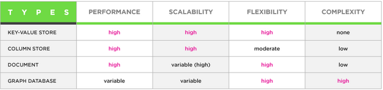
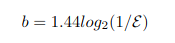
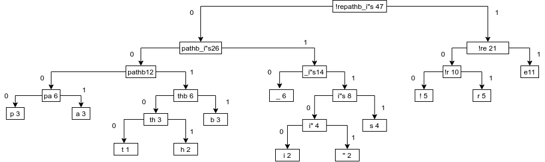
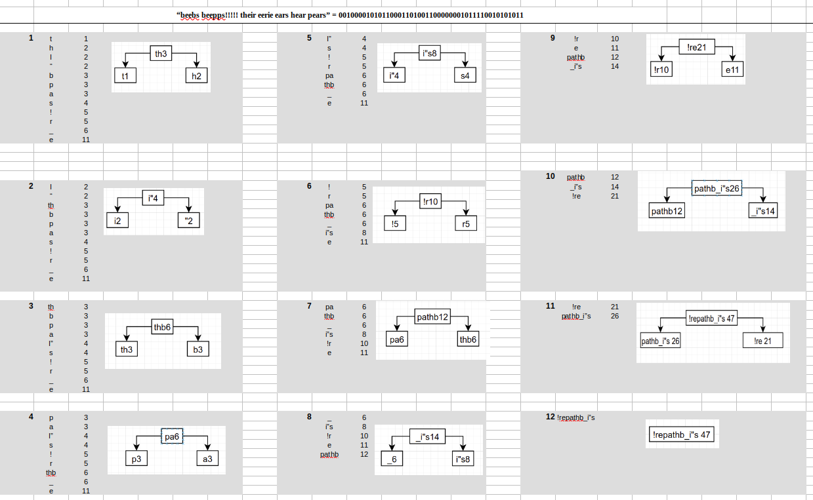
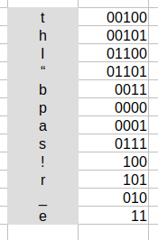
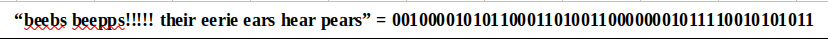

# Databases for Developers - Assignment 2

## Task 1 - investigation

### 1. What is point of NoSQL databases ?

There are four non-relational database types also called NoSql or "not only sql".

1. Key-value model
2. Column store
3. Document database
4. Graph database

All of them have different strength and weaknesses. See below:



**Reason to use NoSql are as follows:**

1. storing of **large** data that often have little to no structure.
2. no limits of data types you can store together
3. can store data in one place without defining the types in advance. Schemas are very flexible.
4. easy to use for cloud computing and storage
5. it is easy to scale horizontal
6. easy to distribute across a cluster
7. rapid development when updating because of nearly no downtime
8. easy to implement
9. they are fault tolerant

* * *

### 2. What is the CAP theorem ?

CAP theorem in distributed systems are as followed:

- **C** => **C**onsistency
- **A** => **A**vailability
- **P** => **P**artion tolerance

**Consistency:**

a guarantee that every node in a distributed cluster returns the same, most recent, successful write. consistency refers to every client having the same view of the data. there are various types of consistency models. consistency in cap (used to prove the theorem) refers to linearizability or sequential consistency, a very strong form of consistency. 

**Availability:** 

every non-failing node returns a response for all read and write requests in a reasonable amount of time. the key word here is every. to be available, every node on (either side of a network partition) must be able to respond in a reasonable amount of time. 

**Partition tolerance:**

the system continues to function and upholds its consistency guarantees in spite of network partitions. network partitions are a fact of life. distributed systems guaranteeing partition tolerance can gracefully recover from partitions once the partition heals.

###### ref: [DZone](https://dzone.com/articles/understanding-the-cap-theorem)

* * *

### 3.  What are ideal use cases of HBase?

The ideal use cases for using HBase is as follows:

1. if you need consistency and scalability
2. you need fast processing
3. if you want to store a large dataset
4. if you prefer a schema-less database structure
5. if you need a breakdown insurance

###### ref: [DataFlair](https://data-flair.training/blogs/hbase-pros-and-cons/)

* * *

## Task 2 - Bloom filters

### 1. What is a bloom filter ?

A Bloom filter is a space-efficient probabilistic data structure, conceived by Burton Howard Bloom in 1970, that is used to test whether an element is a member of a set. False positive matches are possible, but false negatives[1] are not – in other words, a query returns either "possibly in set" or "definitely not in set". Elements can be added to the set, but not removed (though this can be addressed with the counting Bloom filter variant); the more items added, the larger the probability of false positives.

###### ref: [Wikipedia](https://en.wikipedia.org/wiki/Bloom_filter/)

[1]
false negative =>

the person is not infected when they actually are
don’t have antibodies when they actually do

false positive =>

indicates the person is infected when they are not
they have antibodies when they don’t

* * * 

### 2. What is an advantage of bloom filters over hash tables?

A bloom filter doesn't store the elements themselves, like  a hash table would do. 
You use the bloom filter not to find out if the element is present but rather if it is not. Bloom filter guarantees no false negatives. That means it will not tell you that it has an element when in reality it doesn't. 

It uses a lot less disk or memory space because the bloom filter stores bytes, zeros and ones.

### 3. What is a disadvantage of bloom filters?

- Unlike other Data Structures, deletion operations are not possible in the Bloom Filter, because if we delete one element we might end up deleting some other elements also, since hashing is used to clear the bits at the indexes where the elements are stored.
- If the Bloom filter reports that a element is found/present, there is a small chance that it is not.
- bloom filters can not be scaled because we do not store the items in the bloom filter so rehashing is not an option.

###### ref: [MANNING.com](https://freecontent.manning.com/all-about-bloom-filters/)

* * *
### 4. Implement a bloom filter
```
// Java program to implement
// Bloom Filter using Guava Library

import java.nio.charset.Charset;
import com.google.common.hash.BloomFilter;
import com.google.common.hash.Funnels;

public class BloomFilterDemo {


    // reference https://www.geeksforgeeks.org/bloom-filter-in-java-with-examples/
    public static void main(String[] args)
    {

        // Create a Bloom Filter instance
        BloomFilter<String> blackListedIps
                = BloomFilter.create(
                Funnels.stringFunnel(
                        Charset.forName("UTF-8")),
                10000);

        // Add the data sets
        blackListedIps.put("192.170.0.1");
        blackListedIps.put("75.245.10.1");
        blackListedIps.put("10.125.22.20");

        // Test the bloom filter
        System.out.println(
                blackListedIps
                        .mightContain(
                                "75.245.10.1"));
        System.out.println(
                blackListedIps
                        .mightContain(
                                "101.125.20.22"));
    }
}
```
* * *

### 5. If you are to store one million ASCII strings with an average size of 10 characters in a hash set, what would be the approximate space consumption?
FORMEL: -(n * math.log(p))/(math.log(2)^2)
n = antal elementer
p = falsk positiv procent i decimal

3,32193E7
* * *

### 6. The following equation gives the required number of bits of space per inserted key, where "E" is the false positive rate.



* * * 

### 7.  How many bits per element are required for a 1% false positive rate?

10 bits – fordi ovenstående formel fra punkt 6 med følgende udregning:
1.44*log2(1/0.01) – ”0.05” er lig med de 5%.
* * *

### 8. How many bits per element are required for a 5% false positive rate?

7 bits – fordi ovenstående formel fra punkt 6 med følgende udregning:
1.44*log2(1/0.05) – ”0.05” er lig med de 5%.
* * *

### 9. If you are to store one million ASCII strings with an average size of 10 characters in a bloom filter, what would be the approximate space consumption, given an allowed false positive rate of 5%?

FORMEL: -(n * math.log(p))/(math.log(2)^2)
n = antal elementer
p = falsk positiv procent i decimal
-(1000000*(-2,99) / 0,4761 = 6.280.193 bits
## Task 3 - Huffman coding

### 1. Generate Huffmann Code (and  draw  the  Huffmann  Tree)  based  on the following string: “beebs beepps!!!!! their eerie ears hear pears”

[Hoffmann tree Excel calculations]("./hoffman_code/hoffman_tree.ods")










* * *

### 2. How many bits is the compressed string? How many bits is the raw ASCII string?

Compressed string = 149 bits
ASCII string = 376 bits (47 tegn * 8 bit pr. tegn)
* * *

### 3. Compress “pete is here” with the Huffmann tree from before.

// todo
* * *

### 4. Write your own 10 word sentence. Generate the Huffmann Code (a newHuffmann Tree), and write a new compressed message (ie. in binary).Swap with one of your fellow students, and decompress each other’s message.

// todo

* * * 

## Task 4 - Map and Reduce

Solutions to be found in map_reduce.js file. 