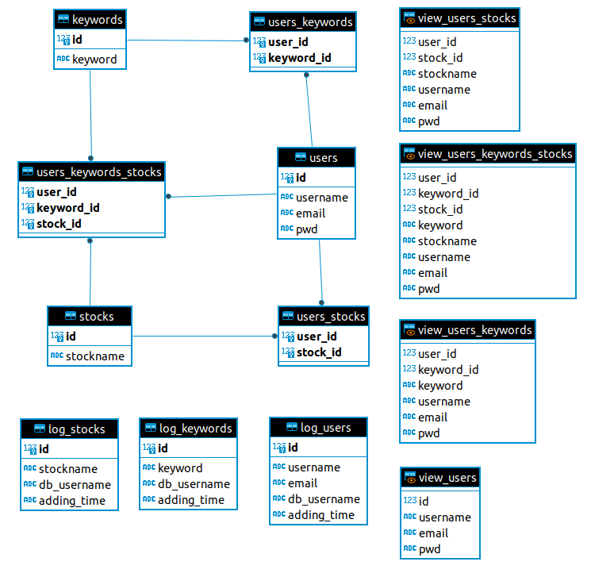
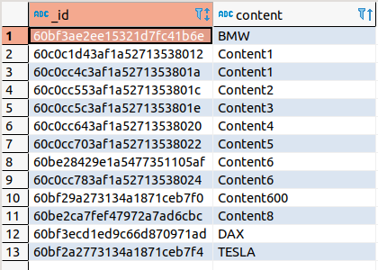
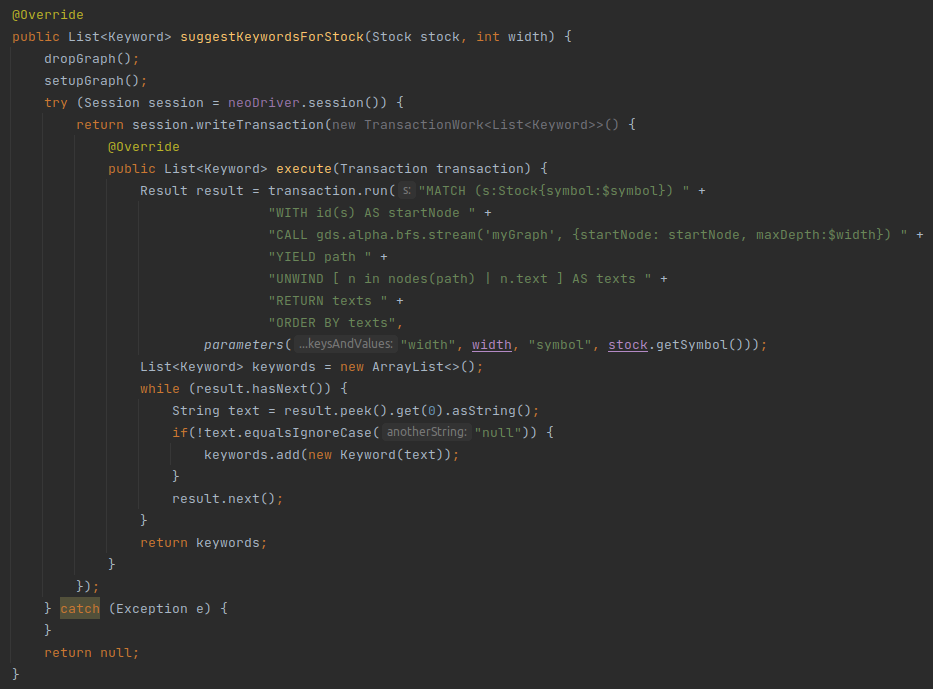

[**HOME**](README.md)

# 3 Databaser

 

## Postgres (Relation DB)

* Sructure of data is known to us and will not change
* No big data volume
* Use of RDMS functions, like triggers
* Most knowledge and the one we used longest

 

 

## MongoDB (Document Store)

* need of a fast and scalable database
* data is not always known to us

 

 

## Neo4j (Graph DB)

* highly connected data
* Neo4j is made for traversing through nodes
* fast and scalable
* we can make use of Neo4j graph algorithms like breadth-first search (BFS) 

 

